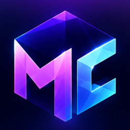
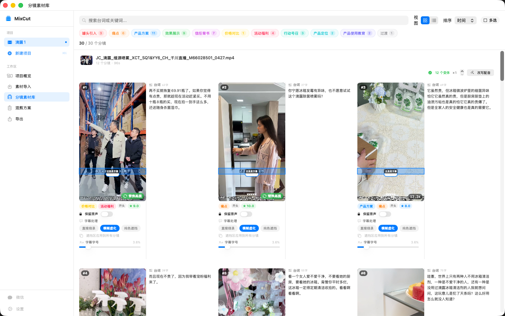
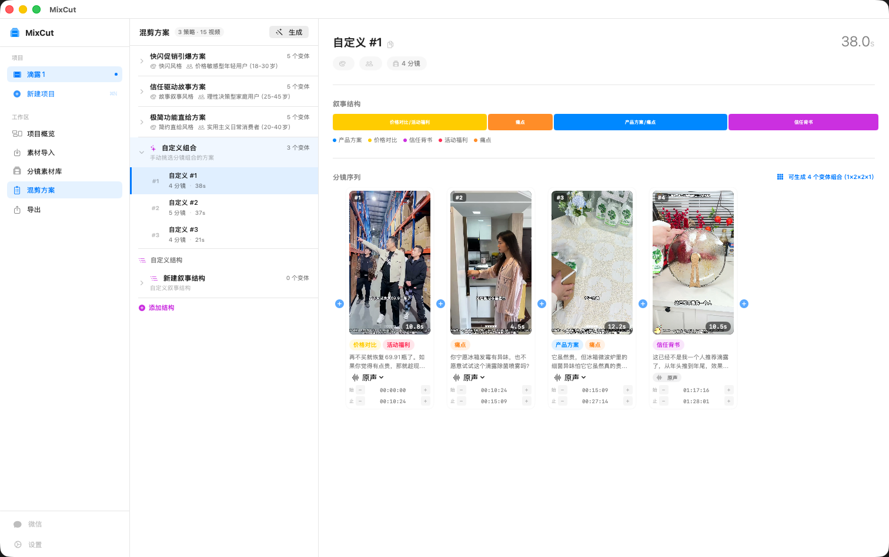
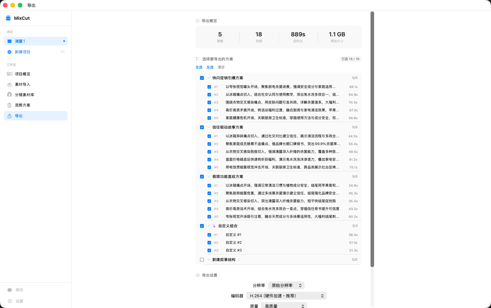
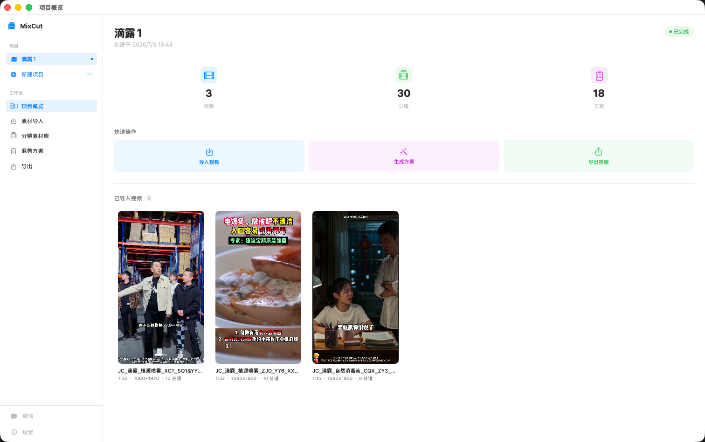

<div align="center">



# MixCut

**AI 广告视频混剪工具 · macOS 原生 · 开箱即用**

一堆投放素材丢进去，AI 自动切分镜、排列组合、改写口播、克隆原声、烧录字幕，一键批量出几十条差异化广告。

[](https://github.com/RoshanGH/mixed_cut/releases)
[](https://github.com/RoshanGH/mixed_cut/releases)
[](https://github.com/RoshanGH/mixed_cut/releases)
[](https://github.com/RoshanGH/mixed_cut/stargazers)
[](./LICENSE)

[**⬇️ 下载**](#-下载) · [**✨ 功能**](#-功能亮点) · [**🚀 快速开始**](#-快速开始) · [**🛠 开发者**](#-开发者--技术架构) · [Gitee 镜像（国内）](https://gitee.com/jinxiushanhehao/mixed_cut/releases)

</div>

<div align="center">
  
</div>

---

## 这是什么

**MixCut 是一款面向广告投放团队的 macOS 桌面应用。** 你把广告素材视频导进来，它用本地信号提取 + 云端 AI 语义决策，把视频拆成一个个带类型标注的分镜，再帮你：

- 🎬 **智能混剪** —— AI 出策略 → 按策略排列分镜组合 → 一键批量导出多条差异化广告
- 🗣️ **AI 配音 / 口播替换** —— 一键改写台词 → 克隆原视频说话人音色 → 合成配音 → 保留原 BGM → 烧录新字幕
- 🖼️ **分镜头 AI 画面替换**（v0.7.0）—— 把一个分镜切成物理镜头，对单个镜头用提示词替换画面（换背景 / 换主体 / 换颜色）

> 🔒 视频内容和 API Key **全部本地处理**，AI 调用只发送结构化文本、**从不上传你的视频**。
> 📦 FFmpeg / Whisper / 人声分离模型**全部内置**，像剪映一样**双击即用、零依赖**。
> 💻 **Apple Silicon 与 Intel Mac 都原生支持**（Universal 二进制）。

---

## 📥 下载

| 平台 | 链接 | 说明 |
|------|------|------|
| **GitHub** | [**下载最新版 →**](https://github.com/RoshanGH/mixed_cut/releases/latest) | 全球，附带 DMG |
| **Gitee（国内）** | [**下载最新版 →**](https://gitee.com/jinxiushanhehao/mixed_cut/releases) | 国内下载更快 |

下载 `.dmg` → 拖进 **Applications** → 首次启动如提示「无法打开」，**右键 → 打开** 即可。无需安装 Homebrew / FFmpeg / Whisper 等任何东西。

---

## ✨ 功能亮点

### 🎬 AI 智能混剪



- **AI 语义切分** —— 自动识别 11 种语义类型（噱头引入 / 痛点 / 产品方案 / 效果展示 / 信任背书 / 价格对比 / 活动福利 / 行动号召 / 产品定位 / 产品使用教育 / 过渡）
- **两步生成方案** —— ① AI 出策略（风格 / 受众 / 叙事结构）② AI 按策略排列分镜组合
- **变体组合** —— 一个策略可展开成多个变体组合（如 `1×2×2×1`），批量出片
- **本地语音识别** —— 内置 whisper.cpp，完全离线，输出字级时间戳；识别不准时可用阿里 `paraformer` 云端**重识别单条分镜**纠正台词
- **多 AI 提供商** —— 千问 / MiniMax / DeepSeek / Claude / 国内转发网关 / 自定义 OpenAI 兼容

<br clear="right" />

### 🖼️ 分镜头 AI 画面替换（v0.7.0 新增）


- **物理镜头切分** —— 把一个逻辑分镜按画面变化度切成多个实质镜头，可**合并 / 拆分 / 拖动微调边界**（总时长恒等于原分镜）
- **提示词替换画面** —— 对单个镜头输入提示词（如「把可乐换成雪碧，手和背景不变」），AI 替换画面，**进多少秒出多少秒**、零帧漂移
- **就地替换、可恢复** —— 合成结果直接替换原分镜画面（不新增分镜、不打乱排列组合），音频 / 台词 / 字幕参数全部保留，随时切回原画面
- **悬停即播** —— 每个镜头、每个变体都能悬停播放，切得对不对一眼看清

<br clear="right" />

### 🗣️ AI 配音 / 口播替换

- **一键改写** —— AI 按多种广告风格，一次为每条分镜改写出多套差异化台词
- **原声克隆** —— 内置 demucs 分离纯人声 → 用千问 `qwen-vc` 克隆原视频说话人音色，**自动克隆、无需手动选音色**
- **人声 / BGM 分离** —— 分离模型已随包内置（离线、无需下载），配音时保留原视频背景音乐
- **配音合成 + 时长对齐** —— TTS 合成后按分镜时长对齐（变速），克隆配音 + 原 BGM 混音
- **烧录字幕** —— 字号无级可调、随分辨率自适应；**所见即所得**（示例字幕叠在真实画面上、导出 = 预览）；三种字幕处理：直接烧录 / 模糊虚化 / 纯色遮挡（盖住旧字幕再烧新字幕）
- **变体批量导出** —— 每条分镜「原版 + 勾选的配音变体」一键批量出多个 MP4；逐项「参与组合」开关，精确控制导出条数、不爆炸

### 🎞️ 视频处理与导出



- **硬件加速导出** —— 默认 H.264 VideoToolbox 硬件编码，Apple Silicon 5–10× 软件编码速度
- **分镜批量导出** —— 多选分镜 → 单独 MP4，文件命名 `{编号}_{原视频名}.mp4`
- **第一帧无黑屏** —— trim filter + setpts 精确切片，QuickTime 立即显示画面
- **视频全局共享** —— 同一视频（SHA-256 哈希）跨项目共享，分镜修改全局同步；导入已分析视频秒级完成

<br clear="right" />

### ⌨️ 顺手的体验

键盘快捷键（`⌘N` 新建 / `⌘1~5` 切工作区 / `⌘B` 侧边栏 / `⌘/` 快捷键面板）· 应用启动恢复上次项目 · 应用内更新检查 · Toast / Skeleton / 错误横幅完整反馈体系 · 强制浅色外观。

---

## 🖥️ 界面一览

| 项目概览 | 分镜素材库 |
|:---:|:---:|
|  |  |
| **混剪方案** | **分镜头替换 / 批量导出** |
|  |  |

> 所有视频素材统一 **9:16 竖屏**（面向手机端信息流广告）。

---

## 🚀 快速开始

1. 从 [Releases](https://github.com/RoshanGH/mixed_cut/releases/latest) 下载 DMG，拖进 **Applications**（首次启动右键 → 打开）。
2. 打开 **设置 → AI 配置**，填入 API Key：

| 提供商 | 说明 |
|--------|------|
| **千问 (Qwen)** | 阿里通义千问；配音的原声克隆 / TTS / 单分镜重识别 / 画面替换也走千问（DashScope） |
| **MiniMax** | MiniMax 系列 |
| **DeepSeek** | DeepSeek 系列 |
| **Claude** | Anthropic 官方 API |
| **国内转发网关** | 转发到 Claude / Gemini / OpenAI 之一 |
| **自定义** | 任意 OpenAI 兼容 API（自填地址 + 模型名） |

> 配音（原声克隆 / TTS）与分镜头画面替换依赖千问 DashScope，需开通对应能力并保证账户有可用额度。

3. **系统要求**：macOS 14.0 (Sonoma) 及以上；首次启动自动下载 Whisper 模型（仅一次），人声分离模型已内置无需下载。

---

## 🛠 开发者 & 技术架构

MixCut 是纯 **SwiftUI + SwiftData** 原生应用，无第三方 SPM 依赖。设计上把「精确信号提取」和「语义决策」分开——所有视觉/音频信号由本地 FFmpeg / Whisper 精确提取成结构化数据，再交给 AI 做语义决策，**不把视频喂给 AI**。

**技术看点**

- 🧩 **本地 AI 流水线** —— FFmpeg 场景/静音/I-frame 检测 + whisper.cpp ASR + 四阶段边界优化，AI 只收结构化文本
- 🧪 **跨端可复用纯逻辑** —— `MixCutCore` 把字幕渲染/落位、变体组合、边界对齐、语速规划等抽成纯 Swift 模块，`swift test` 直接跑单测（无需 Xcode）
- 💻 **Universal 二进制** —— 主程序 + 内置 ffmpeg / ffprobe / whisper / demucs 全部 arm64 + x86_64 静态自包含，Intel Mac 原生可用
- 🔌 **多提供商抽象** —— `AIProvider` 协议统一 OpenAI 兼容调用，Settings 改动即时生效

```
SwiftUI Views  →  @Observable ViewModels (MainActor)  →  Service Layer (actor)
                                                            ├─ SceneDetection / ASR(+paraformer) / AIAnalysis
                                                            ├─ ScriptRewrite / SchemeGen / Export·DubExport
                                                            └─ TTS(克隆/合成) / VocalSeparation(demucs) / Boundary
MixCutCore（纯逻辑·可单测）  ·  SwiftData（8 个 @Model）  ·  内置 FFmpeg / whisper.cpp / demucs
```

**本地构建**

```bash
git clone https://github.com/RoshanGH/mixed_cut.git
cd mixed_cut

# 生成内置 universal 二进制到 Resources/bin/（静态自包含 arm64+x86_64）
./scripts/build_universal_binaries.sh
python3 bundle_deps.py          # 校验四个二进制均为 universal

open MixCut.xcodeproj           # 用 Xcode 打开（SwiftData 宏依赖 Xcode 编译器）
```

> 要求 Xcode 15.0+ / Swift 5.10+。更详细的架构、数据模型与开发规范见 [`CLAUDE.md`](./CLAUDE.md) 与 [`PRODUCT_SPEC.md`](./PRODUCT_SPEC.md)。
>
> 🪟 Windows 版（C# + WPF + .NET 8）：[RoshanGH/mixcut-windows](https://github.com/RoshanGH/mixcut-windows)

---

## 🗺 Roadmap

**已完成**

- [x] 素材导入 + AI 分析流水线（场景/静音/I-frame + Whisper + AI 语义切分 + 边界优化）
- [x] 分镜素材库（11 类筛选、边界微调、多选、批量导出/删除）+ 单分镜重识别
- [x] 混剪方案生成（两步 AI 流程 + 变体组合 + 4 层 JSON 容错）
- [x] 硬件加速导出 + 分镜批量导出（编号命名、无开头黑屏）
- [x] AI 配音（改写 + 原声克隆 + demucs 分离 + TTS 对齐 + BGM 混音）
- [x] 烧录字幕系统（字号可调 + 所见即所得 + 三种字幕处理）
- [x] **分镜头 AI 画面替换**（物理镜头切分 + 提示词替换 + 就地可恢复）

**规划中**

- [ ] 项目模板与方案预设
- [ ] 跨项目素材搜索
- [ ] 多语言字幕 / 配音适配

---

## 📮 联系 & 反馈

- **开发者**：MengGang · [@RoshanGH](https://github.com/RoshanGH)
- **手机 / 微信**：13462890087
- **问题反馈**：[GitHub Issues](https://github.com/RoshanGH/mixed_cut/issues)

如果 MixCut 对你有帮助，欢迎点个 ⭐ Star 支持一下！

## License

[MIT License](./LICENSE) © MengGang
