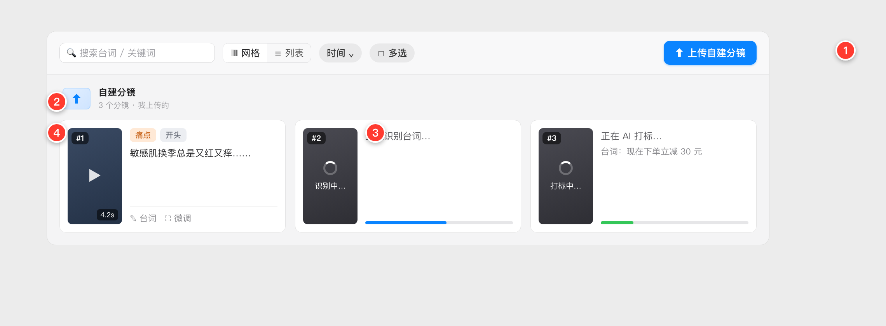

# PRD 05 · 自建分镜上传（Windows 端逐样式对齐）

> 对齐目标：**macOS 版（本功能首发版本，实现后回填具体版本号）**。
> 本文档详细到「Windows 只看本 issue 即可 1:1 复现」：产品逻辑、功能逻辑、**精确样式规格**、交互流程、状态机、边界异常全含。
> 配图为**高保真样式示意图**（Mac 实现完成后**替换为真机+编号标注截图**，本 PRD 与截图随 Mac 端改动同步更新）。
> 技术实现（数据模型/服务/流程）见配套 **[05-自建分镜上传-TRD](./05-自建分镜上传-TRD.md)**。

---

## 0. 一句话与背景
**一句话**：允许用户在「分镜素材库」里**上传自己的成品短视频当作分镜**——一个文件就是一个分镜，**不做镜头切分**，只对它做 **ASR 台词提取 + AI 语义打标**，之后**完全当普通分镜用**（编辑、导出、参加方案组合、所有 AI 功能）。

**背景**：现有分镜只能由"导入长视频 → AI 切分"产生。用户手里常已有剪好的单条分镜素材，希望直接拿进来参与混剪，而不必先拼成长视频再让 AI 切。

---

## 1. 范围与边界（先划清）
- **一个上传文件 = 一个分镜**（不切分），且**单条时长不超过 15 秒**（超过就等于成片、不再是分镜，上传时拦截）。
- 上传的分镜**统一归入一个固定分类「自建分镜」**，与"按来源视频分组"平级、**固定排在分镜库最上方**。
- **自建分镜是"分镜"、不是"视频/成片"**：它**不出现**在项目概览 / 素材导入页的「已导入视频」列表、**不计入「视频」数**；但**计入「分镜」数**、只在分镜素材库作为分镜出现。
- 上传后处理**只有两步**：**ASR 台词提取** + **AI 语义打标**（语义类型/位置/关键词）。**不做场景切分、不做边界优化**。
- 就绪后的自建分镜与普通分镜**功能完全一致**：可改台词、改标签、微调边界、单独导出、配音/克隆、画面替换、参加自定义方案与排列组合。
- **不在本功能范围**：批量文件夹导入、自动去重合并（去重按现有 contentHash 逻辑，见 §8）。

---

## 2. 名词与数据概念
| 名词 | 含义 |
|---|---|
| 自建分镜 | 用户上传的单个成品短视频（**≤15 秒**），**它就是一个分镜**。产品与界面上**没有"视频"概念**——用户看到的就是一个分镜卡。它在数据库里如何落库是纯技术细节，见 TRD §2，产品无需关心。 |
| 「自建分镜」分类 | 分镜库里把所有「自建」标记的分镜**聚合显示**的一个固定分组（分组标题固定，不按单个文件名分组）。 |
| 处理中 | 自建分镜从上传到就绪之间的中间态（识别中/打标中），卡片显示占位与进度。 |

---

## 3. 界面总览（红色编号对应下表）



> 图示：分镜库顶部工具栏右侧的「⬆ 上传自建分镜」按钮（①）；上传后「自建分镜」分组（②）里出现处理中占位卡 —— #2「识别中…」/#3「打标中…」、带底部进度条（③）；处理完变正常分镜卡 #1（④）。没有任何自建分镜时该分组不显示，上传按钮仍在工具栏常驻。

### 编号 → 控件 → 功能
| # | 控件 | 功能 / 规格 |
|---|------|------|
| 1 | 「⬆ 上传自建分镜」按钮 | 放在**分镜库顶部工具栏右侧**（与搜索/视图/排序/多选那排同一行）。点击弹系统文件选择器（可多选 mp4/mov、≤15 秒）。**常驻**（有无自建分镜都在）。见 §4.2。 |
| 2 | 「自建分镜」分组 | 分镜库内容区里的一个分组（与"按视频分组"平级，**排最上方**）。标题栏对齐现有视频分组标题栏（图标块 36×28 + 标题「自建分镜」+ 计数副标题）。**没有任何自建分镜时该分组不显示**。见 §4.1 / §4.5。 |
| 3 | 处理中占位卡 | 上传后立即出现的占位卡，像导入成片那样自动处理：缩略图盖遮罩 + 转圈 + `识别中…`（走 ASR）→ `打标中…`（走 AI）；信息区显示状态文案 + 底部**进度条**。见 §4.4。 |
| 4 | 就绪分镜卡 | 处理完成后 = **普通分镜卡**（9:16 竖屏缩略图 + 编号 #N + 语义/位置 chip + 台词 + 操作 + 右键菜单）。**复用现有分镜卡、零新增样式**。见 §4.3。 |

---

## 4. 精确样式规格

### 4.1 「自建分镜」分组标题栏（对齐现有视频分组标题栏）
- 布局：`HStack(spacing: 10)`，`padding(.horizontal, 4)`；与下方网格间距 `12`。**标题栏右侧无按钮**（上传入口在工具栏，见 §4.2）。
- **图标块**：`36×28pt`，圆角 `5`，填充蓝色淡底（`accentColor.opacity(0.12)` 或渐变 `#E3F0FF→#CFE4FF`），描边 `accentColor.opacity(0.15) 1px`；内含上传图标 `tray.and.arrow.up`（或 `square.and.arrow.up`），`14pt`，`accentColor`。
- **标题**：`自建分镜`，SF `12pt / medium`，色 `#1D1D1F`，`lineLimit(1)`。
- **副标题**：`N 个分镜 · 我上传的`，SF `10pt`，色 tertiary（约 `#9A9A9E`），标题下 `2pt`。

### 4.2 「⬆ 上传自建分镜」按钮（在顶部工具栏）
- 位置：**分镜库顶部工具栏最右侧**（与搜索框、网格/列表切换、排序、多选按钮同一行）。
- 样式：主按钮，蓝底白字（`accentColor` 底、白字），圆角 `8`，内边距约 `6×14pt`，SF `12.5pt / semibold`，图标 `square.and.arrow.up` + 文案 `上传自建分镜`。
- 状态：**始终可点、常驻**（有无自建分镜都在）；批量上传进行中可显示"上传中…"但不禁止继续追加。

### 4.3 自建分镜卡（复用现有分镜卡，不新增样式）
- **完全复用**分镜库现有的 `SegmentCard`（网格视图）/ `SegmentRow`（列表视图）；网格 `LazyVGrid(GridItem(.adaptive(minimum: 360, maximum: 460)), spacing: 12)`。
- 缩略图 **9:16 竖屏**（信息流广告统一竖屏）；左上角编号 `#N`（组内按 startTime 升序 1-based）；语义类型 chip（多彩）、位置 chip；台词文本；底部操作（台词编辑/微调/播放等）。
- 右键菜单同普通分镜（含本批新增的「拆分」，见 PRD 06）。
- 结论：**卡片零新增样式**，Windows 直接复用其分镜卡实现即可。

### 4.4 处理中占位卡（简洁，复用导入成片的处理体验）
上传后**立即**在「自建分镜」分组里出现占位卡，随后自动走处理，与导入长视频时的处理体感一致：
- **缩略图**：盖半透明遮罩（黑 `opacity 0.35~0.5`）+ 居中转圈 `18pt`（白）+ 其下文案 `10pt` 白：`识别中…`（ASR 阶段）→ `打标中…`（AI 阶段）。
- **信息区**：一行状态文案 `12pt`（`正在识别台词…` → `正在 AI 打标…`）；到打标阶段可提前显示已识别的台词（灰、`11pt`）；**底部一条进度条**（`height 4`、圆角 `2`；识别阶段蓝 `accentColor`、打标阶段绿 `#34C759`，可为不确定态动画）。
- **不做**空态虚线框、多行骨架等额外装饰。
- 处理中卡片**不可进入检视/编辑**（点按无效或轻提示"处理中"）。

### 4.5 分组的显隐与排序
- 「自建分镜」分组**排在分镜库内容区最上方**（第一组），其后才是各视频分组。
- **没有任何自建分镜时，该分组不显示**（与"没有视频就没有该视频分组"一致）；上传入口始终在工具栏常驻。
- 组内排序：按加入顺序 1-based 编号。

---

## 5. 交互流程

### 5.1 上传入口
- 点顶部工具栏「⬆ 上传自建分镜」→ 系统文件选择器，**允许多选**，文件类型限 `mp4 / mov`（其余灰掉/过滤）。
- **上传前校验时长**：单条 > 15 秒**直接拒绝**并提示「自建分镜不能超过 15 秒，请裁剪后再上传」；多选时**逐个校验**——合规的正常处理、超时的跳过并汇总提示。

### 5.2 处理流水线（每个上传文件独立走）
1. **落盘**：复制到 App 视频目录（按现有 hash 存储路径规则）；生成缩略图（9:16 首帧）。
2. **建分镜**：把它作为**一个分镜**落库、打「自建」标记（在数据库里具体怎么存是纯技术细节，见 TRD §2，产品无感）。此刻卡片以「处理中·识别中…」出现在分类里。
3. **ASR 台词提取**：对整片做 ASR（引擎见 TRD，阿里 paraformer 优先/whisper 兜底），写入分镜 `text`。
4. **AI 语义打标**：对该分镜做「只打标不切分」的 AI 调用，得语义类型（可多）、位置、关键词，写入分镜。状态切「打标中…」。
5. **就绪**：卡片转为正常分镜卡（显示台词 + 标签），此后=普通分镜。
- 多文件：并发/顺序由 TRD 定；每张卡**各自**显示自己的处理进度，互不阻塞。

### 5.3 就绪后（=普通分镜）
- 可改台词、增删语义类型、改位置、微调边界（帧级）、播放、右键（重命名/删除/**拆分**）。
- 可被勾选进入**批量导出**（编号 + 命名规则同现有）。
- 可参加**自定义方案 / 排列组合**；可做**配音/克隆、画面替换**等全部 AI 能力。
- 与普通分镜在数据与行为上**无差别**。

---

## 6. 状态机（单个自建分镜）
```
上传中(复制/建实体) → 识别中(ASR) → 打标中(AI) → 就绪
                     �“任一步失败” ↘ 失败(卡片显示错误 + 重试入口)
```
- **失败态**：缩略图角标/信息区显示人话错误（如「台词识别失败，点重试」「AI 打标失败，点重试」），提供**重试**按钮（只重跑失败那步）。ASR 失败但允许**保留分镜、台词为空**（用户可手填），不阻断"就绪"（打标可继续/手动）。
- 关键原则：**每步独立容错**，某步失败不删分镜、不阻断其他分镜。

---

## 7. 边界与异常
| 场景 | 处理 |
|---|---|
| 重复文件（内容 hash 相同） | 走现有去重：同 hash 视为已存在，提示「已存在，已跳过」，不重复建实体。 |
| 非 mp4/mov | 文件选择器过滤；拖入非法类型 → 提示「仅支持 mp4 / mov」。 |
| 时长超 15 秒 | **拦截、不允许上传**，提示「自建分镜不能超过 15 秒（超过就等于成片了），请裁剪后再上传」。多选时超时项跳过、合规项照常。 |
| ASR 失败 | 保留分镜、台词留空 + 失败提示 + 重试；不阻断。 |
| AI 打标失败 | 保留分镜、标签留空（默认「过渡」占位）+ 失败提示 + 重试；用户也可手动打标。 |
| 上传中删除 | 支持取消/删除处理中的分镜（同现有"删除即取消"）。 |
| 无 API Key | AI 打标这步提示「请先在设置配置 API Key」，分镜仍建成、台词仍可识别；打标可后补。 |

---

## 8. 与现有功能的关系（重要：零特殊化）
自建分镜就绪后在数据上与普通分镜**同构**，因此现有一切能力**自动可用、无需特殊分支**：
- 分镜库：筛选（语义类型 chip）、搜索（台词/关键词）、排序、多选、批量导出、右键菜单。
- 方案：自定义方案、AI 方案生成、排列组合、导出。
- AI：配音/声音克隆、画面替换/重绘、逐句字幕。
> Windows 实现时应保证：自建分镜与普通分镜走**同一套下游代码**，只在"分组展示"和"上传+处理流水线"两处新增，其余不复制逻辑。

---

## 9. 验收清单（Windows 端自测）
- [ ] 顶部工具栏右侧常驻「⬆ 上传自建分镜」按钮；有自建分镜时最上方出现「自建分镜」分组，无则不显示该分组。
- [ ] 点「上传自建分镜」可多选 mp4/mov。
- [ ] 上传 > 15 秒的文件被拦截并提示；多选时超时项跳过、合规项照常处理。
- [ ] 上传后立即出现占位卡「识别中…→打标中…」带进度条，就绪后显示台词 + 语义/位置标签，缩略图 **9:16**。
- [ ] 「自建分镜」分组标题栏（图标块 36×28、标题 12/medium、副标题 10/tertiary）与视频分组标题栏一致；工具栏上传按钮为蓝底白字。
- [ ] 就绪自建分镜：可改台词/标签、微调边界、右键（含拆分）、被勾选批量导出、参加方案组合、可配音/画面替换。
- [ ] 重复文件跳过并提示；非法格式拦截并提示；某步失败有人话错误 + 重试且不影响其它分镜。
- [ ] 处理中卡片不可进入编辑；删除处理中分镜=取消处理。

---

## 10. 关联文档
- 技术实现：[05-自建分镜上传-TRD](./05-自建分镜上传-TRD.md)
- 相关功能：[06-分镜拆分-PRD](./06-分镜拆分-PRD.md)（自建分镜同样可被拆分）
