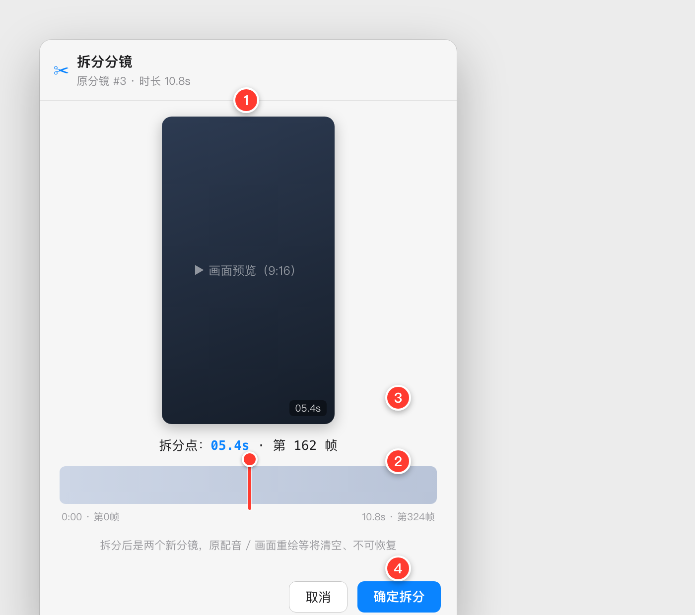

# PRD 06 · 分镜拆分（Windows 端逐样式对齐）

> 对齐目标：**macOS 版（本功能首发版本，实现后回填版本号）**。
> 图为**高保真样式示意图**（Mac 实现后替换真机+编号标注截图），本 PRD 与截图随 Mac 端改动同步更新。
> 技术实现见 **[06-分镜拆分-TRD](./06-分镜拆分-TRD.md)**。

---

## 0. 一句话
在分镜素材库里，把一个分镜（普通分镜、自建分镜都行）**看着画面、把手柄拖到某个时间点 / 某一帧，准确地切成前后两个分镜**。

---

## 1. 范围与边界
- 入口：分镜卡**右键 →「拆分」**。
- **前置拦截**：若该分镜**已被任一方案（组合）引用**，**不允许拆分**——弹提示，让用户先在方案里移除对它的使用，再回来拆。
- 拆分定位：**帧级**（靠拖轴 + 画面预览定位，用户不必手输帧号）。
- 拆分后：两段是**全新分镜**，台词**各自重新识别**；原分镜的衍生产物（克隆配音 / 逐句字幕 / 画面重绘替换）**全部清空、不可恢复**（合并也不恢复）。两段正常进入后续所有流程。

---

## 2. 界面（红色编号对应下表）

| # | 控件 | 功能 / 规格 |
|---|------|------|
| 1 | 画面预览（9:16 竖屏） | 拖动手柄时**实时显示该时刻的画面帧**，让用户看着画面找切点。约 174×310pt，圆角 10。 |
| 2 | 时间轴 + 红色拆分手柄 | 一条横向轨道（对齐分镜时长）+ 一根**红色竖直手柄**（圆点便于拖）。左右拖 → 画面(①)与时间(③)实时跟随。轨道两端标 `0:00·第0帧` / `总时长·末帧`。 |
| 3 | 拆分点：时间 · 帧 | 当前手柄位置对应的 `X.Xs`（蓝色强调）+ `第 N 帧`；等宽字体。 |
| 4 | 取消 / 确定拆分 | 「确定拆分」蓝底白字主按钮；「取消」次按钮。底部一行小灰字提醒：`拆分后是两个新分镜，原配音 / 画面重绘等将清空、不可恢复`。 |

> 弹窗固定竖向布局：标题栏（`✂ 拆分分镜` + `原分镜 #N · 时长 Xs`）→ 预览 → 时间·帧 → 时间轴 → 提醒 → 底部按钮。

---

## 3. 交互流程
1. 分镜卡**右键 →「拆分」**。
2. 若该分镜在方案里 → **拦截提示**（§4），不进弹窗。
3. 弹窗打开：手柄默认落在分镜**中点**；**拖动手柄** → 预览画面 `seek` 到该帧实时更新、③ 的时间·帧同步刷新。
4. 点**「确定拆分」** → 在该帧把分镜切成前后两段，弹窗关闭；两段**就地替换**原分镜位置，各自进入短暂"识别中…"（重新识别台词）后就绪。
5. **「取消」** → 不做任何改动。

---

## 4. 前置拦截（已在方案里）
- 触发：点「拆分」时该分镜的方案引用非空。
- 文案：`该分镜已被用于 N 个方案的组合，请先在这些方案里移除对它的使用，再来拆分`。
- 行为：只提示、**不拆分、不进弹窗**。

---

## 5. 拆分后行为
- **两段**：A = `[原起, 拆分帧]`、B = `[拆分帧, 原止]`；同一来源，按时间接续排在原位置。
- **台词**：两段**各自重新 ASR**（阿里 paraformer），得各自台词。
- **衍生物清空**：原分镜的配音变体 / 逐句字幕、画面重绘替换、物理镜头变体**全部删除**（两段从零开始；合并也不恢复）。
- **缩略图**：两段各自重新抽首帧（9:16）。
- **语义标签**：两段**继承**原分镜的语义类型 / 位置 / 关键词（用户可再手动改）。
- **编号 / 顺序**：组内按时间重排。
- 之后两段 = 普通分镜，进入后续全部流程（导出 / 方案组合 / 配音 / 画面替换）。

---

## 6. 边界与异常
| 场景 | 处理 |
|---|---|
| 手柄拖到太靠端点 | **限制**手柄范围，任一段不得短于最小时长（如 ≥ 若干帧 / 0.3s），避免切出空段。 |
| 拆分后某段重识别失败 | 该段台词留空 + 可手填/重试，**不阻断拆分本身**。 |
| 反悔 | 拆分**不可撤销**（衍生物已删）；确定前底部有明确提醒（§2 ④）。 |
| 自建分镜 | 同样可拆，行为一致（自建分镜的来源即它自己那段视频）。 |

---

## 7. 验收清单（Windows 端自测）
- [ ] 分镜卡右键有「拆分」；该分镜在方案里时点拆分 → 拦截提示、不进弹窗。
- [ ] 弹窗拖动手柄，**画面实时变**、时间·帧同步；能定位到帧。
- [ ] 「确定拆分」后切成两段，各自重新识别台词，衍生物清空，两段就地接续、进入后续流程。
- [ ] 手柄不能拖到切出过短段；重识别失败不影响拆分本身。
- [ ] 弹窗样式（9:16 预览、红色拆分手柄、时间·帧、按钮、提醒）与本图一致。

---

## 8. 关联文档
- 技术实现：[06-分镜拆分-TRD](./06-分镜拆分-TRD.md)
- 相关：[05-自建分镜上传-PRD](./05-自建分镜上传-PRD.md)（自建分镜同样可被拆分）
